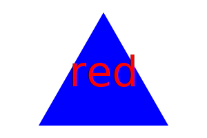

# Logos

## Description 

This project constructs a Node.js command-line app (inquirer package) that takes in user input and generates a logo.svg according to simple modifications that are asked inb the terminal. Since there isnt a deployed page for this, I've provided a walkthrough video on how to run the software through node.js.

<br/>
<br/>


## Table of Contents

* [Installation](#installation)
* [Usage](#usage)
* [Credits](#credits)
* [License](#license)
* [Walkthrough](#walkthrough)


<br/>
<br/>

## Installation

To install necessary dependencies, run the following commands (assuming you are on git bash and already have node.js installed):

1. Clone the repository where you want to save the code:  
```
git clone [HTTPS/SSH/CLI link]
``` 

2. Navigate over to files in terminal
3. Type in terminal:  
``` 
npm i
```   
4. Run through node in the terminal:  
``` 
node index.js
``` 

In order to use Jest library to see that code passes tests that were given:

1. change your directory to include the lib file:
``` 
cd ./lib
``` 

2. If you havent installed Jest yet, you need to install it as a development dependency using the following command:

``` 
npm i --save-dev jest
``` 

3. To run all tests:

``` 
npm run test
``` 
<br/>

## Usage

This program can be used to create simple icons/logos with up to three characters and with the option of up to three shapes in the svg file. Users can observe instances of how testing should be done to check that code is working and not presenting errors. This code also can show users instances of how two libraries can be used to make programs (specifically Jest and Inquirer).
<br/>
<br/>


## Credits

### Creation
* [Rbustan0](https://github.com/Rbustan0) 
* UCLA Ext Web Dev Bootcamp sample Jest test files given

<br/>

### Extensions/Libraries used
node.js, inquirer 8.2.4, jest 29.5.0

<br/>
<br/>


## License
  
  

  
<br/>
<br/>


## Walkthrough

### Video

Here is a video to show you how to run the program on your terminal and check to see that your logo is there.

<br/>
<br/>

### Images of Samples

Here are some sample images you can find in the repository in the examples folder. Keep in mind that when you run the program, it will replace **logo.svg** with whatever you customize.

<br/>
<br/>
<br/>

 